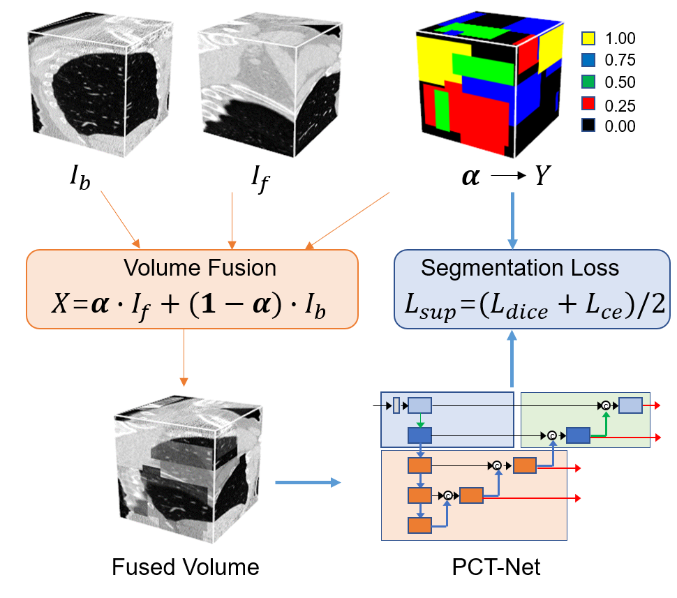
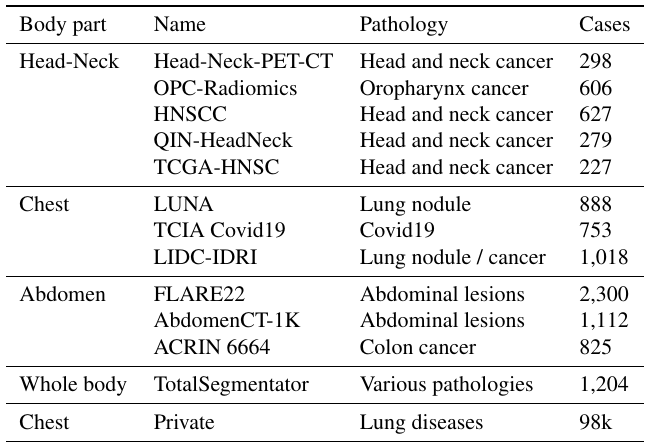

# Medical Image Segmentation Foundation Model
<!-- select Model and/or Data and/or Code as needed>
### Welcome to OpenMEDLab! 👋

<!--
**Here are some ideas to get you started:**
🙋‍♀️ A short introduction - what is your organization all about?
🌈 Contribution guidelines - how can the community get involved?
👩‍💻 Useful resources - where can the community find your docs? Is there anything else the community should know?
🍿 Fun facts - what does your team eat for breakfast?
🧙 Remember, you can do mighty things with the power of [Markdown](https://docs.github.com/github/writing-on-github/getting-started-with-writing-and-formatting-on-github/basic-writing-and-formatting-syntax)
-->


<!-- Insert the project banner here 
<div align="center">
    <a href="https://"></a>
</div>
-->

---

<!-- Select some of the point info, feel free to delete -->
<!-- [](https://twitter.com/opendilab) -->
[](https://pypi.org/project/DI-engine/)


<!-- 


[](https://codecov.io/gh/opendilab/DI-engine) -->

<!-- 
[](https://github.com/opendilab/DI-engine/stargazers)
[](https://github.com/opendilab/DI-engine/network)

[](https://github.com/opendilab/DI-engine/issues)
[](https://github.com/opendilab/DI-engine/pulls)
[](https://github.com/opendilab/DI-engine/graphs/contributors) -->
[](https://github.com/opendilab/DI-engine/blob/master/LICENSE)

This repository provides the official implementation of "MIS-FM: Medical Image Segmentation Foundation Model 
Pretrained with Large-Scale Unannotated 3D Images using Volume Fusion".

## Key Features

- A new self-supervised learning method based on Volume Fusion that is a segmentation-based pretext task.
- A new network architecture PCT-Net that combines the advantages of CNNs and Transformers.
- A foundation model that is trained from 100k unannotated 3D CT scans. 

## Links

- [Paper (To be shown on arxiv soon)](https://)
- [Model (Google Drive)](https://https://drive.google.com/file/d/1jQc-2hhsp3EyZj54_KEJte85diUtW8Fg/view?usp=sharing)
<!-- [Code] may link to your project at your institute>


<!-- give a introduction of your project -->
## Details

The following figure shows an overview of our proposed method for pretraining with unannotated 3D medical images. We introduce a pretext task based on sudo-segmentation, where Volume Fusion is used  to generate paired images and segmentation labels to pretrain the 3D segmentation model, which can better match the downstream task of segmentation than existing Self-Supervised Learning (SSL) methods. 

<!-- Insert a pipeline of your algorithm here if got one -->
<div align="center">
    <a href="https://"></a>
</div>

The pretraining strategy is combined with our proposed PCT-Net to obtain a pretrained model that is applied to segmentation of different objects from 3D medical images after fine tuning with a small set of labeled data.


## Datasets

We used 10k CT volumes from public datasets and 98k private CT volumes for pretraining.
<div align="center">
    <a href="https://"></a>
</div>

## Demo for using the pretrained model

**Main Requirements**  
> torch==1.10.2  
> PyMIC 

To use [PyMIC](https://github.com/HiLab-git/PyMIC), please download the latest code in the master branch, and add the path of PyMIC source code to `PYTHONPATH` environmental variable. See `bash.sh` for example.


**Demo data**

In this demo, we show the use of PCT-Net for left atrial segmentation. The dataset can be downloaded from [PYMIC_data](https://drive.google.com/file/d/1eZakSEBr_zfIHFTAc96OFJix8cUBf-KR/view?usp=sharing).

The dataset, network and training/testing settings can be found in configuration files: `demo/pctnet_scratch.cfg` and `demo/pctnet_pretrain.cfg` for training from scratch and using the pretrained weights, respectively.

After downloading the data, edit the value of `root_dir` in the configuration files, and make sure the path to the images is correct.

**Training**
```bash
python train.py demo/pctnet_scratch.cfg
```
or 

```bash
python train.py demo/pctnet_pretrain.cfg
```

**Inference**
```bash
python predict.py demo/pctnet_scratch.cfg
```
or 

```bash
python predict.py demo/pctnet_pretrain.cfg
```

**Evaluation**
```bash
python $PyMIC_path/pymic/util/evaluation_seg.py -cfg demo/evaluation.cfg
```
You may need to edit `demo/evaluation.cfg` to specify the path of segmentation results before evaluating the performance.

In this simple demo, the segmentation Dice was 90.71% and 92.73% for training from scratch and from the pretrained weights, respectively.

## 🛡️ License

This project is under the Apache license. See [LICENSE](LICENSE) for details.

<!-- ## 📝 Citation

If you find this repository useful, please consider citing this paper:
```
@article{John2023,
  title={paper},
  author={John},
  journal={arXiv preprint arXiv:},
  year={2023}
}
``` -->

