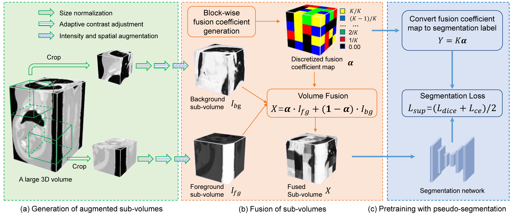
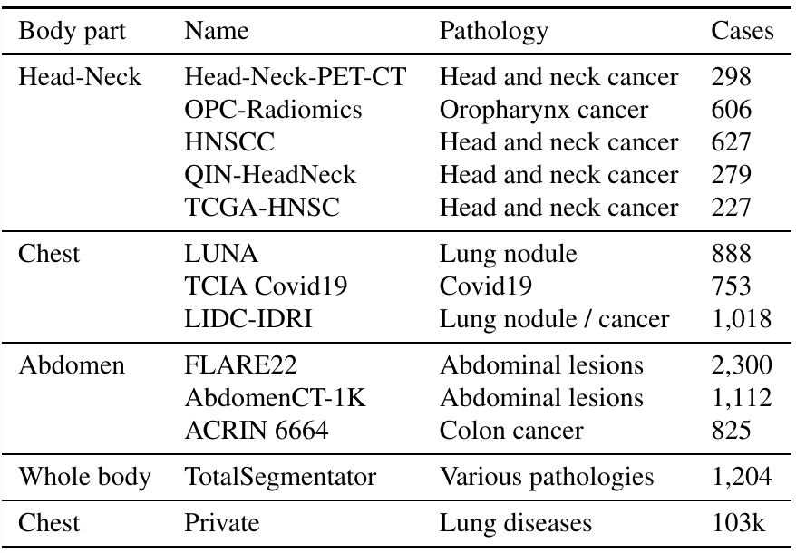

# Medical Image Segmentation Foundation Model
<!-- select Model and/or Data and/or Code as needed>
### Welcome to OpenMEDLab! 👋

<!--
**Here are some ideas to get you started:**
🙋‍♀️ A short introduction - what is your organization all about?
🌈 Contribution guidelines - how can the community get involved?
👩‍💻 Useful resources - where can the community find your docs? Is there anything else the community should know?
🍿 Fun facts - what does your team eat for breakfast?
🧙 Remember, you can do mighty things with the power of [Markdown](https://docs.github.com/github/writing-on-github/getting-started-with-writing-and-formatting-on-github/basic-writing-and-formatting-syntax)
-->


<!-- Insert the project banner here 
<div align="center">
    <a href="https://"></a>
</div>
-->

---

<!-- Select some of the point info, feel free to delete -->
<!-- [](https://twitter.com/opendilab) -->
[](https://pypi.org/project/DI-engine/)


<!-- 


[](https://codecov.io/gh/opendilab/DI-engine) -->

<!-- 
[](https://github.com/opendilab/DI-engine/stargazers)
[](https://github.com/opendilab/DI-engine/network)

[](https://github.com/opendilab/DI-engine/issues)
[](https://github.com/opendilab/DI-engine/pulls)
[](https://github.com/opendilab/DI-engine/graphs/contributors) -->
[](https://github.com/opendilab/DI-engine/blob/master/LICENSE)

This repository provides the official implementation of pretrained medical image segmentation models based on Volume Fusion (VolF), accordingn to the following papers:

* [1] Guotai Wang, Jianghao Wu, Xiangde Luo, Xinglong Liu, Kang Li, Shaoting Zhang, MIS-FM: 3D Medical Image Segmentation using Foundation Models Pretrained on a Large-Scale Unannotated Dataset.
[arXiv:2306.16925](https://arxiv.org/pdf/2306.16925.pdf), 2023.

* [2] Guotai Wang, Jia Fu,Jianghao Wu, Xiangde Luo, Yubo Zhou, Xinglong Liu, Kang Li, Jingsheng Lin, Baiyong Sheng, Shaoting Zhang,
Volume Fusion-based Self-Supervised Pretraining for 3D Medical Image Segmentation. Submitted to MedIA, 2024.
<!-- 
@article{Wang2023arxiv,
  title={MIS-FM: 3D Medical Image Segmentation using Foundation Models Pretrained on a Large-Scale Unannotated Dataset},
  author={Guotai Wang, Jianghao Wu, Xiangde Luo, Xinglong Liu, Kang Li, Shaoting Zhang},
  journal={arXiv preprint arXiv:2306.16925},
  year={2023}
}
@article{Wang2024MisFm,
  title={	Volume Fusion-based Self-Supervised Pretraining for 3D Medical Image Segmentation},
  author={Guotai Wang, Jia Fu,Jianghao Wu, Xiangde Luo, Yubo Zhou, Xinglong Liu, Kang Li, Jingsheng Lin, Baiyong Sheng, Shaoting Zhang},
  journal={Submitted to MedIA},
  year={2024}
}
-->

<!-- [Code] may link to your project at your institute>


<!-- give a introduction of your project -->
## Details

The following figure shows an overview of our proposed method for pretraining with unannotated 3D medical images. We introduce a pretext task based on pseudo-segmentation, where Volume Fusion is used  to generate paired images and segmentation labels to pretrain the 3D segmentation model, which can better match the downstream task of segmentation than existing Self-Supervised Learning (SSL) methods. 

<!-- Insert a pipeline of your algorithm here if got one -->
<div align="center">
    <a href="https://"></a>
</div>

<!-- The pretraining strategy is combined with our proposed PCT-Net to obtain a pretrained model that is applied to segmentation of different objects from 3D medical images after fine tuning with a small set of labeled data.
-->

## VolF for Pre-training
1, The implementation of VolF (and some other self-supervised learning methods) is provided in [PyMIC][pymic_link].
Please see the PyMIC repository for details.  Especially, the following three classes are key components of VolF: 

* `Crop4VolumeFusion` (see `pymic/transform/crop4vf.py`) A data transform operation that crops two sub-volumes 
from a large volume with data augmentation. 

* `VolumeFusion` (see `pymic/transform/crop4vf.py`) Fuse two sub-volumes based on a discretized fusion coefficient map,
and obtain the ground truth for pseudo-segmenation task.

* `SelfSupVolumeFusion` (see `pymic/net_run/self_sup/self_volf.py`) A class for self-supervised training with VolF, which
inherits from a supervised segmentation class. 

2, For examples of using VolF for pretraining, please see a demo implemented in [PyMIC_examples][volf_demo]. 
In that demo, we train a 3D UNet with the LUNA dataset using VolF, and show applying the pretrained model to 
a downstream dataset LCTSC2017 for chest organ segmentation. 

[pymic_link]:https://github.com/HiLab-git/PyMIC
[volf_demo]:https://github.com/HiLab-git/PyMIC_examples/tree/main/seg_self_sup/lung
<!-- ### Datasets

We used 10k CT volumes from public datasets and 103k private CT volumes for pretraining.
<div align="center">
    <a href="https://"></a>
</div>
-->

## List of Pretrained Models
Here we provide a list of models pretrained by VoLF using different network structures and datasets. 
The pretrained weights can be downloaded from [Google Drive](https://drive.google.com/file/d/1jQc-2hhsp3EyZj54_KEJte85diUtW8Fg/view?usp=sharing).

|Network  |Dataset | Model Name| 
|---|---|---|
|FMUNet|AbdomenCT-1K| `fmunet_abk1k_volf.pt`|
|PCT-Net|CT10k| `pctnet_ct10k_volf.pt`|

where FMUNet is a modified version of 3D UNet as described in [2], and PCT-Net is a hybrid model 
using CNN and Transformer proposed in [1].

## Demo for Using the Pretrained Model
**Package and data requirement**

In this demo, we show the use of pretrained FMUNet and PCT-Net for left atrial segmentation. Please install [PyMIC][pymic_link] and its requirements first. PyMIC can be installed by:
```bash
pip install PYMIC==0.5.0
```

The downstream dataset for this demo can be downloaded from [PYMIC_data](https://drive.google.com/file/d/1eZakSEBr_zfIHFTAc96OFJix8cUBf-KR/view?usp=sharing).

The settings for dataset, network and training/testing can be found in configuration files: 

* `demo/pctnet_scratch.cfg` and `demo/fmunet_scratch.cfg` for training from scratch.

* `demo/pctnet_pretrain.cfg` and `demo/fmunet_pretrain.cfg` for using the pretrained models for training.

After downloading the data, edit the value of `train_dir` in the configuration files, and make sure the path to the images is correct.

**Training**
```bash
python net_run.py train demo/{NET_NAME}_scratch.cfg
```
where `NET_NAME` could be `fmunet` or `pctnet`.

**Inference**
```bash
python net_run.py test demo/{NET_NAME}_scratch.cfg
```
where `NET_NAME` could be `fmunet` or `pctnet`.

**Evaluation**
```bash
pymic_eval_seg -cfg demo/evaluation.cfg
```
You may need to edit `demo/evaluation.cfg` to specify the path of segmentation results before evaluating the performance.

In this simple demo, for PCT-Net, the segmentation Dice was 90.71% and 91.80% for training from scratch and from the pretrained weights, respectively. Note that the 
maximal iteration was set to 6000 in this demo for a quick training. You may use a larger iteration number for an even better performance. 

## 🛡️ License

This project is under the Apache license. See [LICENSE](LICENSE) for details.

<!-- ## 📝 Citation

If you find this repository useful, please consider citing this paper:
```
@article{John2023,
  title={paper},
  author={John},
  journal={arXiv preprint arXiv:},
  year={2023}
}
``` -->

